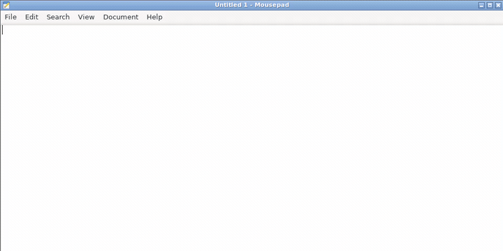

# Otoa Input

話した内容をその場のカーソル位置へ貼り付ける、PC 向けの音声入力ツール。
**軽くて速い。GPU は要りません。**



*話し終えると、認識結果がそのままカーソル位置へ貼り付きます。*
*オーバーレイは「聞き取り中」→「文字にしています」→「貼り付けました」と状態を示します。*

| | |
|---|---|
| **CPU 1 コアで動く** | 7.68 秒の発話を **0.32 秒**で認識（実時間比 0.042） |
| **待ち受け中はほぼ無負荷** | CPU **2%** / メモリ **44 MB** |
| **1 つ起動するだけ** | 実行ファイルは 1 つ。ASR サーバーは必要なときに自分で立ち上がる |
| **外部サービス不要** | クライアントと ASR サーバーの両方が入っている。音声は外へ出ない |

**コア数を増やしても速くなりません。1 コアで足ります。**
20 コアで 0.185 秒、1 コアで 0.324 秒。実測は
[どれくらいの機械で動くか](#どれくらいの機械で動くか)に。

- クライアント — マイク取得、VAD、オーバーレイ、貼り付け（Linux / macOS / Windows）
- サーバー — ReazonSpeech k2-v2 / kodama-ja-streaming-small による日本語音声認識
- 両者は WebSocket の **Otoa ASR Protocol v1** で話す（[`docs/otoa_asr_protocol.md`](docs/otoa_asr_protocol.md)）

## 使ってみる

ビルドは要りません。**1 つ落として、起動するだけです。**
認識モデルは初回起動時に自動で落ちてきます。

### 1. 本体を落とす

[リリースページ](https://github.com/kizuna-intelligence/otoa-input/releases/latest)から
自分の OS のものを取ります。

| OS | ファイル |
|---|---|
| Linux | [`otoa-input-linux-x86_64.AppImage`](https://github.com/kizuna-intelligence/otoa-input/releases/latest/download/otoa-input-linux-x86_64.AppImage) |
| macOS (Apple Silicon) | [`otoa-input-macos-arm64.dmg`](https://github.com/kizuna-intelligence/otoa-input/releases/latest/download/otoa-input-macos-arm64.dmg) |
| Windows | [`otoa-input-windows-x86_64.zip`](https://github.com/kizuna-intelligence/otoa-input/releases/latest/download/otoa-input-windows-x86_64.zip) |

上の表のリンクは常に最新版を指します（名前に版番号を入れていないため）。
今動いているものの版は `--version` で確かめられます。

- **Linux**: 実行できるようにします。`chmod +x otoa-input-*.AppImage`
- **macOS**: `.dmg` を開いて `Otoa Input.app` を「アプリケーション」へドラッグ。
  署名と Apple の公証を通してあるので、そのまま開けます
- **Windows**: `.zip` を展開して `otoa-input.exe`

### 2. 認識モデルは自動で落ちてきます

音声認識のモデルは大きい（数百 MB）ので配布物には同梱していません。
**初回起動時に、選んでいるエンジンのモデルを自動で取得します。**
落とす先はユーザーごとの場所（下の表）で、進み具合は入力バーに出ます。
落とし終えるまで認識は始まりません。回線によっては数分かかります。

途中で終了しても、次の起動で残りだけを取り直します。設定でエンジンを
切り替えたときも、そのエンジンのモデルが無ければ次の起動で自動で取ります。

以下は、自分で置きたい場合（回線が細い、複数台へ配りたい、など）の手順です。

| | ReazonSpeech k2-v2 | kodama-ja-streaming-small |
|---|---|---|
| モデル | 587MB | 309MB |
| メモリ（実測ピーク RSS） | 約 1315MB | 約 450MB |
| 速度（RTF・CPU 2 スレッド） | 0.024〜0.029 | 0.041〜0.053 |
| ライセンス | Apache-2.0 | Apache-2.0 |

既定は ReazonSpeech k2-v2 で、精度を優先する場合に向きます。kodama はメモリを
抑えたい場合の選択肢ですが、**雑音に弱く、SNR 10dB で劣化が大きいほか、短い
発話と固有名詞が苦手**です。

**kodama は長い発話も苦手です。** 手元で測った文字誤り率は、7 秒までは 0.00
ですが、10 秒で 0.42、20 秒で 0.74 まで悪化し、20 秒では最初の発話が丸ごと
落ちました。息継ぎのたびにクライアントが区切るので通常は問題になりませんが、
**息継ぎなしで話し続けると結果が壊れます。**

ReazonSpeech k2-v2 を使う場合:

```bash
pip install -U "huggingface_hub[cli]"
hf download reazon-research/reazonspeech-k2-v2 --local-dir reazonspeech-k2-v2
```

kodama を使う場合:

```bash
pip install -U "huggingface_hub[cli]"
hf download ayousanz/kodama-ja-streaming-small \
  --include tokenizer.json --include "onnx/*" --local-dir kodama-download
mkdir kodama-ja-streaming-small
cp kodama-download/onnx/* kodama-download/tokenizer.json kodama-ja-streaming-small/
```

kodama に必要なのは `onnx/` にある5ファイルと `tokenizer.json` です。5ファイルには
`encoder.onnx.data` と `cross_kv_prefill.onnx.data` も含まれます。**`.onnx.data` を
忘れるとモデルの読み込みに失敗します。**

**取れたフォルダを、次のどちらかにエンジンごとの名前で置きます。**

| | ReazonSpeech k2-v2 | kodama-ja-streaming-small |
|---|---|---|
| 本体の隣（持ち歩くならこちら） | `<本体と同じ場所>/models/reazonspeech-k2-v2` | `<本体と同じ場所>/models/kodama-ja-streaming-small` |
| ユーザーごとの場所 | Linux: `~/.local/share/otoa-input-oss/models/reazonspeech-k2-v2`<br>macOS: `~/Library/Application Support/otoa-input-oss/models/reazonspeech-k2-v2`<br>Windows: `%APPDATA%\otoa-input-oss\models\reazonspeech-k2-v2` | Linux: `~/.local/share/otoa-input-oss/models/kodama-ja-streaming-small`<br>macOS: `~/Library/Application Support/otoa-input-oss/models/kodama-ja-streaming-small`<br>Windows: `%APPDATA%\otoa-input-oss\models\kodama-ja-streaming-small` |

例（Linux で本体の隣に置く場合）:

```
otoa-input-linux-x86_64.AppImage
models/
  reazonspeech-k2-v2/
    encoder-epoch-99-avg-1.onnx
    decoder-epoch-99-avg-1.onnx
    joiner-epoch-99-avg-1.onnx
    tokens.txt
```

使うエンジンは設定画面の「認識エンジン（再起動後に反映）」で選びます。

### 3. 起動する

ダブルクリックするだけです。**認識サーバーは自分で立ち上がるので、別に何かを
起動する必要はありません。** 初回はモデルの読み込みに数秒かかります。

話し終えて少し黙ると、認識結果がカーソル位置へ貼り付きます。

### Linux だけ、追加で要るもの

デスクトップ環境が入っていれば大半は既に入っています。**最小構成の Ubuntu で
確認した、これだけあれば起動するという一覧です。**

```bash
sudo apt install \
  libasound2t64 libgtk-3-0t64 libxcb1 \
  libxkbcommon-x11-0 libayatana-appindicator3-1 libegl1 libgl1 \
  xdotool
```

- `xdotool` は**貼り付けに使います**（Wayland では `wtype`）。入っていないと、
  認識はできるのに貼り付けだけが失敗します
- `libxkbcommon-x11-0` と `libayatana-appindicator3-1` が無いと、**画面が
  出る前に落ちます**
- AppImage を FUSE 無しで動かす場合は `./otoa-input-*.AppImage --appimage-extract`
  で展開し、`squashfs-root/AppRun` を実行してください

### 貼り付け方式

Linux の X11 と Wayland では、本文を CLIPBOARD と PRIMARY の両方へ置いてから
`Shift+Insert` を送ります。既定の `paste_shortcut=auto` は宛先の名前を調べず、
常にこの方式を使います。PRIMARY は貼り付け前の内容を控え、既定では 150ms 後に
元へ戻します（`restore_primary_selection=false` で無効化できます）。

環境により `Shift+Insert` が使えない場合の手動の逃げ道として、設定の
`paste_shortcut` に `ctrl-v`、`ctrl-shift-v`、`shift-insert` を指定できます。
Wayland の貼り付け動作はまだ実測していません。うまくいかない場合は
`paste_shortcut=ctrl-v` を試してください。

## うまくいかないとき

```bash
./otoa-input --check-connection   # 認識サーバーへ繋がるか
./otoa-input --paste-test         # 本文を置いて Shift+Insert を送り、状態を記録する
./otoa-input --help               # オプション一覧
./otoa-input --preview-overlay=listening  # 入力バーを確認する
./otoa-input --preview-settings=general   # 設定画面を確認する
```

- **「認識モデルが見つかりません」** → 上の置き場所を確認してください。
  ReazonSpeech は `reazonspeech-k2-v2` の中に `tokens.txt`、kodama は
  `kodama-ja-streaming-small` の中に `tokenizer.json` がある状態です
- **認識はできるのに貼り付かない（Linux）** → `xdotool` / `wtype` を入れます
- **貼り付かない（macOS）** → システム設定 → プライバシーとセキュリティ →
  アクセシビリティ で `Otoa Input` を許可します

## ソースからビルドする

利用するだけなら不要です。

必要なもの: Rust（stable）と、ビルド時のネットワーク（`sherpa-onnx` が
ONNX Runtime を取得します）。Linux では次も要ります。

```bash
sudo apt install libgtk-3-dev libasound2-dev libxcb1-dev
```

```bash
cargo run --release -p otoa-input-app
```

配布物を作る場合:

```bash
bash scripts/build-release.sh    # 共通
bash scripts/package-linux.sh    # Linux: AppImage
bash scripts/package-macos.sh    # macOS: 署名・公証済み DMG（鍵は環境変数で渡す）
```

別の機械でサーバーだけ動かす場合:

```bash
otoa-input --serve --asr-model-dir=<dir>   # 同じ実行ファイルでサーバーだけ
otoa-asr-server --asr-model-dir=<dir>      # サーバー単体のバイナリ
```

## どれくらいの機械で動くか

Intel Core Ultra 7 265K の **1 コアに CPU 帯域の制限をかけて実測**した。
7.68 秒の日本語発話 1 つを、話し終えてから確定が返るまでの待ち時間。

| 1 コアのうち使える割合 | 待ち時間 | モデル読み込み | 実用性 |
|---|---|---|---|
| 100% | **0.32 秒** | 6 秒 | 快適 |
| 50%  | 0.57 秒 | 6 秒 | 快適 |
| 25%  | 1.18 秒 | 11 秒 | 我慢できる |
| 12%  | 2.69 秒 | 21 秒 | 遅い |
| 6%   | 6.37 秒 | 46 秒 | 実用外 |

**認識結果はどの条件でも同一。** CPU を絞っても精度は落ちず、待ち時間だけが伸びる。

コア数を増やしても速くならない。20 コア 0.185 秒 → 4 コア 0.191 秒 →
2 コア 0.258 秒 → 1 コア 0.324 秒。**この認識器は並列化で速くならないので、
1 コアで足りる。**

- **クライアント側は無視してよい。** マイクを常時待ち受けしていて CPU 2%、
  メモリ 44 MB。VAD は 32 ms ごとに動くが軽い
- **効いてくるのはメモリ。** ASR サーバーが **1.3 GB** 使う。ほとんどが認識
  モデルで、CPU より先にこちらが下限を決める。**2 GB 以上を推奨**

体感の目安は「話し終えてから 1 秒以内に貼り付く」あたり。上の表では
1 コアの 25% 程度が境目になる。

配布物は AppImage 23 MB / DMG 28 MB / zip 24 MB。**実行ファイルは 1 つ**で、
共有ライブラリも追加ファイルも要らない（ONNX Runtime は静的リンク、
VAD モデルはバイナリへ埋め込み）。別途要るのは認識モデルだけ。

## 中身を読む人へ

実装上の約束事は [`docs/design.md`](docs/design.md) にまとめてある。
プロトコルの仕様は [`docs/otoa_asr_protocol.md`](docs/otoa_asr_protocol.md)。

## 主な設定

設定画面（トレイアイコン →「設定」）から変更できます。面は「一般」「マイク」
「認識」「詳細」に分かれています。設定ファイルの場所は
Linux なら `~/.config/otoa-input-oss/settings.json`、認識モデルの既定の探索先は
`~/.local/share/otoa-input-oss/models/<選んだモデル名>` です。


| 項目 | 既定 | 説明 |
|---|---|---|
| サーバー URL | `ws://127.0.0.1:8770/asr/v1` | 接続先 |
| 認識エンジン | `reazonspeech` | 同梱サーバーで使うモデル。変更は再起動後に反映 |
| 発話終了の判定 | `client` | 同梱サーバーは `client` のみ |
| VAD しきい値 | 0.5 | 上げると拾いにくく、下げると誤検知が増える |
| 無音判定 | 300 ms | これだけ黙ると区切る |
| プリロール | 500 ms | 検知が遅れた分をさかのぼって送る長さ |
| `overlay_position` | `center` | 入力バーの位置（中央・画面の下・画面の上） |
| `overlay_transparent` | `auto` | 入力バーの透過表示 |
| `reduce_motion` | `false` | 入力バーの動きを減らす |
| `commit_hold_ms` | `900` | 貼り付けた結果を見せる時間（ミリ秒） |

オプションの一覧は `--help` で出ます。

```bash
cargo run --release -p otoa-asr-server -- --help
cargo run --release -p otoa-input-app -- --help
```

サーバーの `--dump-dir` を指定すると、認識へ渡した音声をそのまま WAV で
書き出します。「先頭が欠ける」ような不具合で、欠けているのが音声なのか
認識結果なのかを切り分けるためのものです。

## 謝辞

このツールが使っている認識モデルは、いずれも他の方の成果です。

### kodama-ja-streaming-small — [ようさん（ayousanz）](https://huggingface.co/ayousanz)

[`ayousanz/kodama-ja-streaming-small`](https://huggingface.co/ayousanz/kodama-ja-streaming-small)（Apache-2.0）

日本語ストリーミング音声認識モデルと、その ONNX 資産。
ベースは Useful Sensors, Inc. (dba Moonshine AI) の
[`moonshine-ai/moonshine-streaming-small`](https://huggingface.co/moonshine-ai/moonshine-streaming-small)（MIT）。

### ReazonSpeech k2-v2 — [Reazon Human Interaction Lab](https://huggingface.co/reazon-research)

[`reazon-research/reazonspeech-k2-v2`](https://huggingface.co/reazon-research/reazonspeech-k2-v2)（Apache-2.0）

日本語音声認識モデル。同ラボの
[ReazonSpeech コーパス](https://huggingface.co/datasets/reazon-research/reazonspeech)（CDLA-Sharing-1.0）で
学習されています。

### そのほか

- **Silero VAD** — Silero Team
  ([snakers4/silero-vad](https://github.com/snakers4/silero-vad))。MIT。
  発話の始まりと終わりの判定に使っています（同梱）
- **sherpa-onnx** — k2-fsa
  ([k2-fsa/sherpa-onnx](https://github.com/k2-fsa/sherpa-onnx))。Apache-2.0
- **ONNX Runtime** — Microsoft。MIT

**認識の質はモデルの質です。** このツールが担っているのは、音声を集めて
渡し、返ってきた文字を貼り付けるところまでで、認識そのものは上のモデルの
成果です。

## ライセンス

MIT。詳細は `LICENSE`、同梱物と別途取得するモデルの表示は `NOTICE` を
参照してください。

依存する第三者クレートの一覧とライセンス全文は `THIRD-PARTY-LICENSES.md`
（`cargo about` で自動生成、配布物へ同梱）にあります。**MPL-2.0 のクレートを
含みます。** いずれも改変せず使っており、配布した版に対応する対象ソース
コードの入手方法も同ファイルに記載しています。

コントリビュートは `CONTRIBUTING.md` を参照してください。DCO による署名を
使います。署名は特許条項への同意も兼ねます（寄与の実施に必要な自分の特許に
ついて通常実施権を許諾するか、関係する特許を通知する）。
